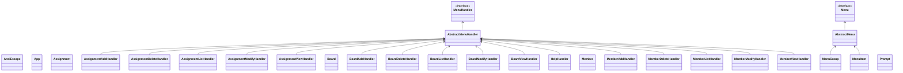

```mermaid
classDiagram
    direction BT
    class AbstractMenu
    class AbstractMenuHandler
    class AnsiEscape
    class App
    class Assignment
    class AssignmentAddHandler
    class AssignmentDeleteHandler
    class AssignmentListHandler
    class AssignmentModifyHandler
    class AssignmentViewHandler
    class Board
    class BoardAddHandler
    class BoardDeleteHandler
    class BoardListHandler
    class BoardModifyHandler
    class BoardViewHandler
    class HelpHandler
    class Member
    class MemberAddHandler
    class MemberDeleteHandler
    class MemberListHandler
    class MemberModifyHandler
    class MemberViewHandler
    class Menu {
        <<Interface>>
    }
    class MenuGroup
    class MenuHandler {
        <<Interface>>
    }
    class MenuItem
    class Prompt

    AbstractMenu ..> Menu
    AbstractMenuHandler ..> MenuHandler
    AssignmentAddHandler --> AbstractMenuHandler
    AssignmentDeleteHandler --> AbstractMenuHandler
    AssignmentListHandler --> AbstractMenuHandler
    AssignmentModifyHandler --> AbstractMenuHandler
    AssignmentViewHandler --> AbstractMenuHandler
    BoardAddHandler --> AbstractMenuHandler
    BoardDeleteHandler --> AbstractMenuHandler
    BoardListHandler --> AbstractMenuHandler
    BoardModifyHandler --> AbstractMenuHandler
    BoardViewHandler --> AbstractMenuHandler
    HelpHandler --> AbstractMenuHandler
    MemberAddHandler --> AbstractMenuHandler
    MemberDeleteHandler --> AbstractMenuHandler
    MemberListHandler --> AbstractMenuHandler
    MemberModifyHandler --> AbstractMenuHandler
    MemberViewHandler --> AbstractMenuHandler
    MenuGroup --> AbstractMenu
    MenuItem --> AbstractMenu
```

