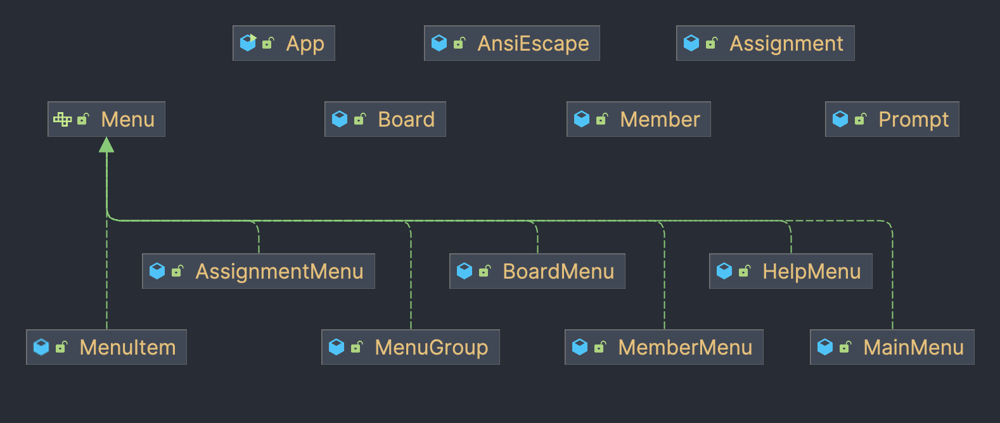

```mermaid
classDiagram
    direction RL
    class AnsiEscape
    class App
    class Assignment
    class AssignmentAddHandler
    class AssignmentDeleteHandler
    class AssignmentListHandler
    class AssignmentModifyHandler
    class AssignmentViewHandler
    class Board
    class BoardAddHandler
    class BoardDeleteHandler
    class BoardListHandler
    class BoardModifyHandler
    class BoardViewHandler
    class HelpHandler
    class Member
    class MemberAddHandler
    class MemberDeleteHandler
    class MemberListHandler
    class MemberModifyHandler
    class MemberViewHandler
    class Menu {
        <<Interface>>
    }
    class MenuGroup
    class MenuHandler {
        <<Interface>>
    }
    class MenuItem
    class ObjectRepository~E~
    class Prompt

    AssignmentAddHandler ..> MenuHandler
    AssignmentDeleteHandler ..> MenuHandler
    AssignmentListHandler ..> MenuHandler
    AssignmentModifyHandler ..> MenuHandler
    AssignmentViewHandler ..> MenuHandler
    BoardAddHandler ..> MenuHandler
    BoardDeleteHandler ..> MenuHandler
    BoardListHandler ..> MenuHandler
    BoardModifyHandler ..> MenuHandler
    BoardViewHandler ..> MenuHandler
    HelpHandler ..> MenuHandler
    MemberAddHandler ..> MenuHandler
    MemberDeleteHandler ..> MenuHandler
    MemberListHandler ..> MenuHandler
    MemberModifyHandler ..> MenuHandler
    MemberViewHandler ..> MenuHandler
    MenuGroup ..> Menu
    MenuItem ..> Menu


```

